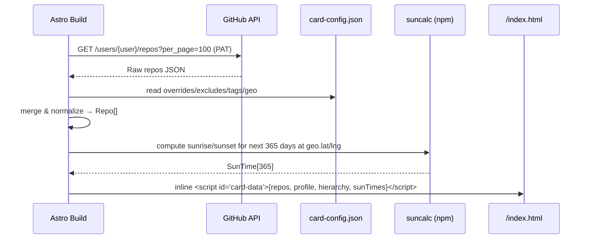
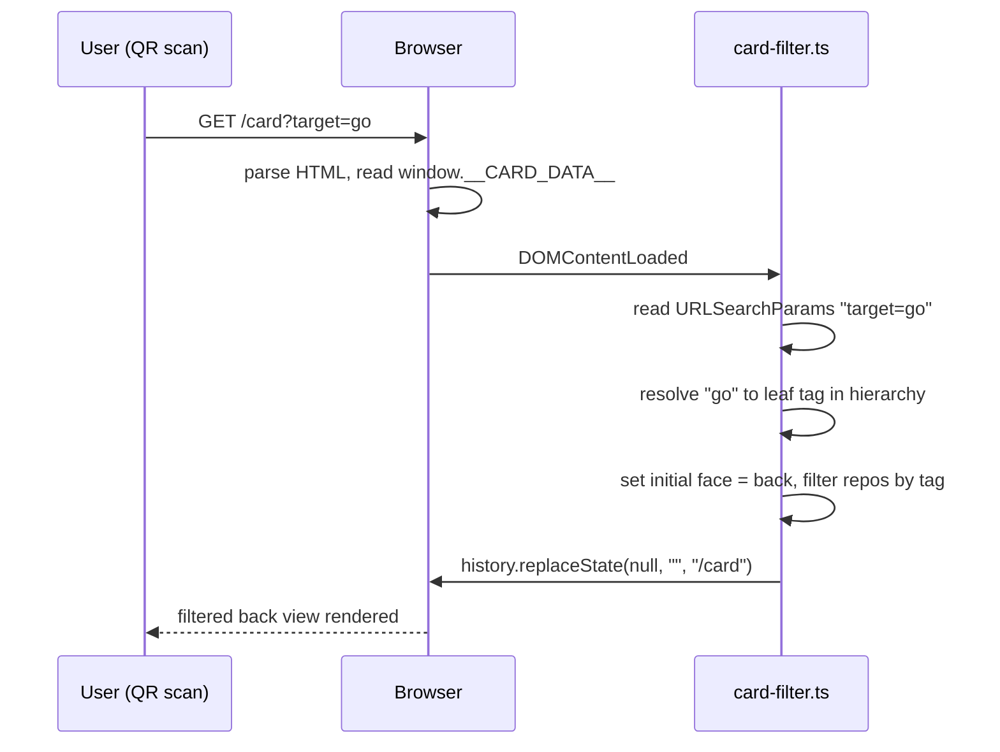
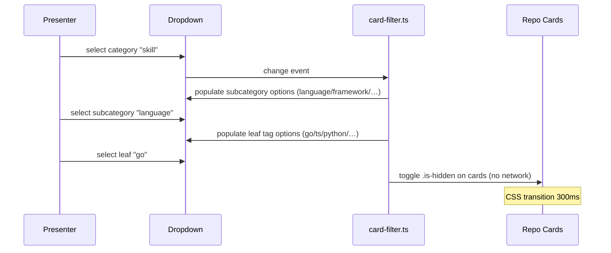
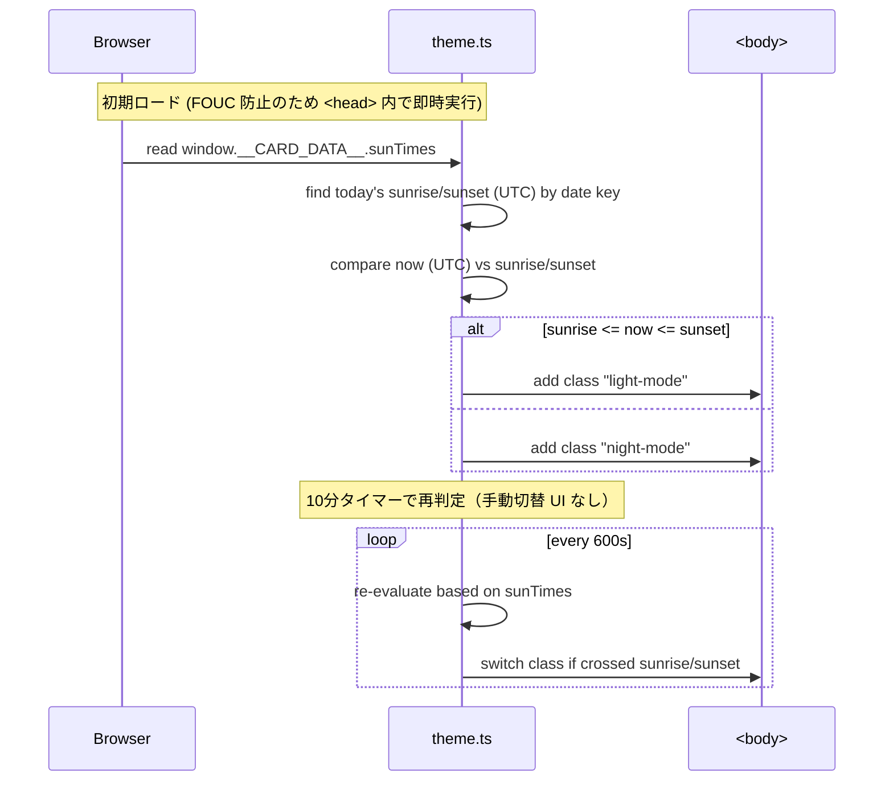

# 設計書 (Design) — デジタル名刺システム

## Overview

本リポジトリは **独立した Astro 5 + Tailwind 4 プロジェクト** として、デジタル名刺サイト単体をビルド・デプロイする（ポートフォリオサイト `portorifo.riumu.net` とは別リポジトリ・別デプロイ）。
ビルド時に GitHub API からリポジトリ一覧を取得し、`card-config.json` とマージした正規化済みデータを HTML にインライン埋め込みすることで、ランタイムでの外部通信をゼロにする。
UI は「表（プロフィール固定）／裏（実績動的）」の二面構造とし、タブ操作で CSS 3D フリップを発火、裏面では階層ドロップダウンによる DOM クラス操作のみでフィルタリングを実現する。
テーマは **日没連動の Auto オンリー**（手動切替 UI なし）を採用し、オフライン要件を満たすため日の出/日没時刻はビルド時に 365 日分計算して埋め込み、ランタイムでの外部 API 呼び出しは行わない。テーマクラス命名（`body.light-mode` / `body.night-mode`）はポートフォリオに整合させる。

### Tech Stack

| Layer | 技術 | Rationale |
|---|---|---|
| Framework | Astro 5 | SSG、Island Architecture、JS フットプリント最小 |
| Styling | Tailwind 4 (`@tailwindcss/vite`) + セマンティック CSS 変数 | ポートフォリオと同じ Tailwind 4 で値写経が容易。`@theme` でセマンティック層を新規導入 |
| Client JS | Vanilla TypeScript | 依存ゼロ、< 15KB gzip 目標 |
| 日没計算 | [`suncalc`](https://github.com/mourner/suncalc)（ビルド時のみ使用、ランタイム未使用） | ライセンス BSD-2、API 不要、純粋計算 |
| デプロイ | 任意（GitHub Pages / Cloudflare Pages / Vercel） | SSG 成果物のみで完結 |

---

## Architecture

### Components

| Component | Layer | Responsibility |
|---|---|---|
| **`fetchRepos.ts`** | Build-time | GitHub API `/users/{username}/repos` を叩き、ページネーション含めて全公開リポジトリを取得 |
| **`mergeConfig.ts`** | Build-time | `card-config.json` を生データにマージ（除外・上書き・タグ付与・階層割当） |
| **`computeSunTimes.ts`** | Build-time | `suncalc` を使い、`card-config.json.geo` の緯度経度で **ビルド日から 365 日分**の日の出/日没時刻（UTC）を計算 |
| **`/index.astro`** | SSG Page | 名刺ページ本体（ルートに配置）。マージ済みデータ + sunTimes を `<script id="card-data" type="application/json">` にインライン埋め込み |
| **`CardFront.astro`** | Component | 表面（氏名・アバター・肩書・SNS リンク） |
| **`CardBack.astro`** | Component | 裏面（階層ドロップダウン＋リポジトリカードグリッド） |
| **`TabSwitcher.astro`** | Component | 表/裏タブ。クリックでフリップ発火 |
| **`card-flip.ts`** | Client | CSS 3D フリップ制御（`.is-flipped` クラスのトグル）。`prefers-reduced-motion` 検知でクロスフェードに切替 |
| **`card-filter.ts`** | Client | 階層ドロップダウン制御、URL param 解釈、`replaceState` 実行、リポジトリカードの表示トグル |
| **`theme.ts`** | Client | 日没連動の自動テーマ判定、`body.light-mode` / `body.night-mode` クラスの付替、10 分タイマー、初期テーマ即時適用（FOUC 防止）。手動切替 UI なし |
| **`src/styles/tokens.css`** | Style | セマンティック CSS 変数の定義（`--color-bg`, `--color-text`, `--color-accent` 等）。`body.light-mode { ... }` / `body.night-mode { ... }` でスコープ切替 |
| **`card-config.json`** | Content | 表示/非表示・カスタムタイトル/説明・タグ・階層割当・プロフィール・緯度経度を保持 |
| **`docs/integration.md`** | Docs | 他者ポートフォリオへの移植ガイド（副次目標。CSS 変数命名規約・設定スキーマ・コピー対象ファイル一覧） |
| **QR アセット** | Static | `/public/qr/card.png`・`/public/qr/portfolio.png` |

### Data Flow

#### Build time



#### Runtime (initial load with `?target=go`)



#### Runtime (in-person hierarchical filter)



#### Runtime (theme system: auto-only)



---

## Data Models

### Build-time output (embedded in HTML)

```typescript
interface CardData {
  generatedAt: string;          // ISO timestamp (build time)
  profile: Profile;
  repos: Repo[];
  hierarchy: HierarchyNode[];   // dropdown tree, from card-config.json
  sunTimes: SunTime[];          // FR-010: build-time computed 365 days of sunrise/sunset
  geo: Geo;                     // FR-010: lat/lng used for sun time computation
}

interface Profile {
  name: string;                 // "庄司 彬人"
  nameEn: string;               // "Akito Shoji"
  avatarUrl: string;            // /public/images/avatar.png (build-time copied)
  title: string;                // "Adtech × AI Engineer"
  tagline: string;              // 一文タグライン
  links: { type: "github" | "x" | "qiita" | "linkedin" | "email"; url: string }[];
}

interface SunTime {
  date: string;                 // "YYYY-MM-DD" (JST date key)
  sunriseUTC: string;           // ISO 8601 UTC timestamp
  sunsetUTC: string;            // ISO 8601 UTC timestamp
}

interface Geo {
  lat: number;                  // -90..90 (default 35.6762 = 東京)
  lng: number;                  // -180..180 (default 139.6503)
  tz: string;                   // IANA timezone (default "Asia/Tokyo") — date key の基準
}

interface Repo {
  id: string;                   // GitHub repo full_name
  name: string;                 // 表示名（config 上書きあり）
  description: string;          // 表示説明（config 上書きあり、日本語化）
  url: string;                  // html_url
  stars: number;                // stargazers_count
  language: string | null;      // GitHub primary language
  tags: string[];               // ["go", "cli", "tool"] — leaf tag IDs
  pinned: boolean;              // config で明示 pin、上位表示
}

interface HierarchyNode {
  id: string;                   // "skill" | "category"
  label: string;                // "Skill" | "Domain"
  children: {
    id: string;                 // "language" | "framework" | "domain"
    label: string;
    leaves: {
      id: string;               // "go" | "typescript" | "flutter"
      label: string;            // "Go" | "TypeScript"
      aliases?: string[];       // URL ?target= 受け取り用の別名
    }[];
  }[];
}
```

### card-config.json schema

```typescript
interface CardConfig {
  profile: Profile;
  geo: Geo;                                     // FR-010: sun time computation source
  hierarchy: HierarchyNode[];
  repoOverrides: Record<string, RepoOverride>; // key: repo full_name
  excludeRepos: string[];                       // repo full_names to exclude
  pinnedRepos: string[];                        // repo full_names to pin
}

interface RepoOverride {
  name?: string;
  description?: string;
  tags?: string[];          // leaf tag IDs to attach
}
```

**Defaults if `geo` is omitted**: `{ lat: 35.6762, lng: 139.6503, tz: "Asia/Tokyo" }`（東京・ポートフォリオと同値）

### Hierarchy (Phase 1 で未確定だった粒度の確定定義)

```json
[
  {
    "id": "skill",
    "label": "Skill",
    "children": [
      {
        "id": "language",
        "label": "Language",
        "leaves": [
          { "id": "go",         "label": "Go",         "aliases": ["golang"] },
          { "id": "typescript", "label": "TypeScript", "aliases": ["ts"] },
          { "id": "python",     "label": "Python" },
          { "id": "dart",       "label": "Dart" }
        ]
      },
      {
        "id": "framework",
        "label": "Framework",
        "leaves": [
          { "id": "flutter", "label": "Flutter" },
          { "id": "nextjs",  "label": "Next.js", "aliases": ["next"] },
          { "id": "astro",   "label": "Astro" }
        ]
      },
      {
        "id": "infra",
        "label": "Infra",
        "leaves": [
          { "id": "gcp",    "label": "Google Cloud" },
          { "id": "docker", "label": "Docker" }
        ]
      }
    ]
  },
  {
    "id": "category",
    "label": "Domain",
    "children": [
      {
        "id": "domain",
        "label": "Domain",
        "leaves": [
          { "id": "adtech", "label": "Adtech" },
          { "id": "ai",     "label": "AI / LLM" },
          { "id": "tool",   "label": "Dev Tool" },
          { "id": "design", "label": "Design" }
        ]
      }
    ]
  }
]
```

- `?target=go` のように URL パラメータは **leaf id または aliases** のいずれかにマッチさせる
- すべての leaf にどのリポジトリも紐付かない場合は **All フォールバック**

---

## UI Design

### Layout (mobile-first, 360px〜430px 基準)

```
┌─────────────────────────────┐  ← viewport top
│   ┌───────────────────┐     │
│   │  [Front] | [Back] │     │  TabSwitcher (sticky top)
│   └───────────────────┘     │
│                             │
│   ┌─────────────────────┐   │  ← .card (perspective: 1200px)
│   │                     │   │
│   │   ┌─────────────┐   │   │  CardFront (initial face)
│   │   │  [Avatar]   │   │   │
│   │   │             │   │   │
│   │   │  庄司 彬人    │   │   │
│   │   │  Akito Shoji │   │   │
│   │   │  GENIEE      │   │   │
│   │   │  tagline     │   │   │
│   │   │ GH  X  Mail  │   │   │
│   │   └─────────────┘   │   │
│   │                     │   │
│   └─────────────────────┘   │
│                             │
└─────────────────────────────┘

When .is-flipped on .card:
   .card-front  → rotateY(180deg) → hidden
   .card-back   → rotateY(0deg)   → visible
```

### Flip mechanics (FR-003 + NFR Accessibility)

```css
/* Default: 3D flip */
.card { transform-style: preserve-3d; transition: transform 600ms ease; }
.card.is-flipped { transform: rotateY(180deg); }
.card-front, .card-back {
  backface-visibility: hidden;
  position: absolute; inset: 0;
}
.card-back { transform: rotateY(180deg); }

/* prefers-reduced-motion: 3D flip → crossfade */
@media (prefers-reduced-motion: reduce) {
  .card { transform: none !important; transition: none; }
  .card-front, .card-back {
    backface-visibility: visible;
    transition: opacity 300ms ease;
  }
  .card.is-flipped .card-front { opacity: 0; pointer-events: none; }
  .card.is-flipped .card-back  { opacity: 1; pointer-events: auto; }
  /* default state when not flipped */
  .card .card-front { opacity: 1; }
  .card .card-back  { opacity: 0; pointer-events: none; }
}
```

- タブクリック → `card.classList.toggle('is-flipped')` のみ
- 切り替え完了は `transitionend` イベントで検知（必要時）
- `card-flip.ts` 側で `window.matchMedia('(prefers-reduced-motion: reduce)').matches` を読み、必要に応じて transitionend のターゲットイベントを `opacity` に切替

### Hierarchical dropdown (FR-006)

```
┌──────────────────────────────────┐
│ Category ▼  Subcategory ▼  Tag ▼ │
└──────────────────────────────────┘
        │             │         │
        v             v         v
     skill        language    go
     category    framework   typescript
                 infra        …
                 …
```

- 3 段の `<select>` を横並び（モバイルでは縦積み）
- 上位選択が変わると下位を `card-filter.ts` が動的再構築
- Tag 確定で `repos.filter(r => r.tags.includes(tagId))` 相当を DOM クラスで実現:
  - 非対象カード: `.repo-card.is-hidden { opacity: 0; transform: scale(0.95); pointer-events: none; }`
  - transition: `opacity 300ms ease, transform 300ms ease`

### Repo card

```
┌──────────────────────────────────┐
│ repo-name                  ⭐ 42 │
│ 説明（日本語、config 上書き済）   │
│ [go] [cli] [tool]                │
│ → github.com/user/repo           │
└──────────────────────────────────┘
```

### Theme tokens (FR-010 / FR-011 / FR-012)

セマンティック CSS 変数を `src/styles/tokens.css` に集約し、`body.light-mode` / `body.night-mode` でスコープを切り替える。値はポートフォリオ本番 CSS から写経。

```css
/* src/styles/tokens.css */

/* デフォルト = night-mode 相当（ポートフォリオの未付与時挙動と整合） */
:root {
  /* Semantic colors */
  --color-bg: #0f0f23;
  --color-bg-grad: linear-gradient(135deg, #0f0f23, #1a1a2e, #16213e);
  --color-text: #ffffff;
  --color-text-muted: #d1d5db;
  --color-accent: #22d3ee;       /* cyan-400 */
  --color-accent-strong: #a78bfa; /* purple-400 */
  --color-surface: rgba(255, 255, 255, 0.05);  /* glass */
  --color-border: rgba(255, 255, 255, 0.1);

  /* Spacing / radius / typography */
  --radius-md: 0.5rem;
  --radius-lg: 0.75rem;
  --font-body: system-ui, -apple-system, "Hiragino Sans", "Yu Gothic UI", sans-serif;
  --font-heading: var(--font-body);
  --font-mono: ui-monospace, "SF Mono", Menlo, monospace;

  /* Motion */
  --transition-theme: background 0.5s ease, color 0.3s ease;
}

/* night-mode を明示クラスで指定された場合も同じ */
body.night-mode {
  /* :root の値を継承 */
}

/* light-mode: ポートフォリオの本番カラーを写経 */
body.light-mode {
  --color-bg: #cbd5e1;
  --color-bg-grad: linear-gradient(135deg, #cbd5e1, #94a3b8, #64748b);
  --color-text: #1f2937;
  --color-text-muted: #374151;
  --color-accent: #0c4a6e;       /* cyan-900 equivalent */
  --color-accent-strong: #7c3aed; /* purple-700 */
  --color-surface: rgba(255, 255, 255, 0.4);
  --color-border: rgba(0, 0, 0, 0.2);
}

body {
  background: var(--color-bg-grad);
  color: var(--color-text);
  font-family: var(--font-body);
  transition: var(--transition-theme);
}
```

| Token | Night (default) | Light |
|---|---|---|
| `--color-bg-grad` | `linear-gradient(#0f0f23 → #16213e)` | `linear-gradient(#cbd5e1 → #64748b)` |
| `--color-text` | `#ffffff` | `#1f2937` |
| `--color-text-muted` | `#d1d5db` | `#374151` |
| `--color-accent` (cyan) | `#22d3ee` | `#0c4a6e` |
| `--color-accent-strong` (purple) | `#a78bfa` | `#7c3aed` |
| `--color-surface` (glass) | `rgba(255,255,255,0.05)` | `rgba(255,255,255,0.4)` |
| `--color-border` | `rgba(255,255,255,0.1)` | `rgba(0,0,0,0.2)` |

- **必須トークン**: `--color-bg-grad`, `--color-text`, `--color-accent`（最低限の整合）
- **任意トークン**: surface / border / radius / spacing 系（再利用者が省略可）
- **`prefers-color-scheme` は使用しない**（テーマ切替は日没連動 Auto に固定。OS 設定とは独立）

---

## Build-time integration (FR-007 / FR-008 / FR-010)

### Astro page front-matter (`src/pages/index.astro`)

```typescript
---
import { fetchRepos } from "../lib/fetchRepos";
import { mergeConfig } from "../lib/mergeConfig";
import { computeSunTimes } from "../lib/computeSunTimes";
import cardConfig from "../../card-config.json";

const rawRepos = await fetchRepos({
  username: cardConfig.profile.links.find(l => l.type === "github")!.url.split("/").pop()!,
  token: import.meta.env.GITHUB_PAT, // optional but recommended
});

const merged = mergeConfig(rawRepos, cardConfig);
const sunTimes = computeSunTimes(cardConfig.geo, 365); // FR-010: 365 days
const cardData = { ...merged, sunTimes, geo: cardConfig.geo };
---
<script id="card-data" type="application/json" set:html={JSON.stringify(cardData)} />
```

- `set:html` で JSON を `<script type="application/json">` にエスケープ込みで埋め込む
- ランタイム JS は `JSON.parse(document.getElementById('card-data').textContent)` で読む
- `window.__CARD_DATA__` をシンボリックに公開してデバッグ容易化（型は `CardData`）

### Sun time computation (`computeSunTimes.ts`, FR-010)

```typescript
import SunCalc from "suncalc"; // BSD-2, ~5KB

export function computeSunTimes(geo: Geo, days: number): SunTime[] {
  const today = new Date();
  const out: SunTime[] = [];
  for (let i = 0; i < days; i++) {
    const d = new Date(today);
    d.setDate(today.getDate() + i);
    const t = SunCalc.getTimes(d, geo.lat, geo.lng);
    out.push({
      date: formatJSTDate(d, geo.tz), // "YYYY-MM-DD"
      sunriseUTC: t.sunrise.toISOString(),
      sunsetUTC: t.sunset.toISOString(),
    });
  }
  return out;
}
```

- ビルド時 1 回のみ実行（純粋計算、ネットワーク不要）
- 365 件の SunTime で約 50KB の JSON、gzip 圧縮後は約 8KB（許容範囲内）
- 1 年経過後の再ビルドが必要（Future Considerations の週次 cron で対応可）

### Merge rules (`mergeConfig.ts`)

1. `excludeRepos` に含まれる repo は破棄
2. `repoOverrides[fullName].name/description` があれば上書き
3. `repoOverrides[fullName].tags` を必ず付与（GitHub の `language` から自動推定したタグと union）
4. `pinnedRepos` の順序で先頭にソート、残りは `stars DESC` → `pushed_at DESC`
5. `language` → leaf id 自動マッピング表（`Go→go`, `TypeScript→typescript` 等）

### Pagination

GitHub API `/users/{user}/repos` は 1 req あたり最大 100 件。
1 ページ目を取得し、`Link` ヘッダの `rel="next"` が存在する間は順次取得（最大 5 ページ＝500 リポジトリ想定で十分）。

### Error handling at build

| 失敗ケース | 振る舞い |
|---|---|
| GitHub API 401/403 (PAT 不正) | ビルド失敗（exit 1）、メッセージで PAT 設定を促す |
| GitHub API 5xx / timeout | リトライ 3 回（exponential backoff）、それでも失敗ならビルド失敗 |
| `card-config.json` パースエラー | ビルド失敗、JSON 行番号を表示 |
| PAT 未設定（環境変数なし） | 警告ログを出し未認証で続行（60 req/h で十分なケース向け） |

---

## URL parameter handling (FR-004 / FR-005)

### `card-filter.ts` の起動シーケンス

```typescript
function init() {
  const data: CardData = JSON.parse(
    document.getElementById("card-data")!.textContent!
  );
  const params = new URLSearchParams(location.search);
  const target = params.get("target");

  if (target) {
    const leaf = resolveTarget(target, data.hierarchy);
    if (leaf && hasMatchingRepo(leaf.id, data.repos)) {
      applyFilter(leaf.id);
      setInitialFace("back");
    } else {
      applyFilter(null); // All
      setInitialFace("back");
    }
    // FR-005: param 削除（pushState ではなく replaceState）
    history.replaceState(null, "", "/card");
  } else {
    setInitialFace("front");
    applyFilter(null); // All
  }
}
```

- `resolveTarget` は leaf `id` または `aliases[]` のいずれかと一致するノードを返す
- `hasMatchingRepo` で 0 件ヒットなら All フォールバック

---

## Theme System (Runtime, FR-010)

### `theme.ts` の起動シーケンス

FOUC（Flash Of Unstyled Content）を避けるため、`<head>` 内の **インラインスクリプト**として実行する。`window.__CARD_DATA__` が定義される前に DOM が露出することを防ぐ。

```typescript
// src/scripts/theme-init.inline.ts  (Astro の <script is:inline> として埋め込み)

(function initTheme() {
  // card-data の読み出し（<script id="card-data"> は <head> の直後に配置）
  const raw = document.getElementById("card-data")?.textContent;
  if (!raw) return; // フォールバック: class 未付与 → night-mode 相当
  const data = JSON.parse(raw);

  const todayKey = new Date().toLocaleDateString("ja-JP", {
    timeZone: data.geo.tz,
    year: "numeric", month: "2-digit", day: "2-digit",
  }).replace(/\//g, "-"); // "YYYY-MM-DD"

  const entry = data.sunTimes.find((s: SunTime) => s.date === todayKey);
  if (!entry) {
    // 365 日分を超えた場合のフォールバック: 18:00 を境界に
    const h = new Date().getHours();
    document.body.classList.add(h >= 6 && h < 18 ? "light-mode" : "night-mode");
    return;
  }

  const now = Date.now();
  const sunrise = new Date(entry.sunriseUTC).getTime();
  const sunset  = new Date(entry.sunsetUTC).getTime();
  document.body.classList.add(
    now >= sunrise && now <= sunset ? "light-mode" : "night-mode"
  );
})();
```

### 10 分タイマーによる再判定（`theme.ts`）

```typescript
const REEVAL_MS = 10 * 60 * 1000;

function reevaluate() {
  // theme-init.inline.ts と同じロジックでクラスを付け替える
  // 異なる点: addClass の前に opposite class を remove
}

setInterval(reevaluate, REEVAL_MS);
```

- 手動切替 UI なし（FR-010）。タイマーは常時稼働
- ページがバックグラウンドタブに移動した場合、ブラウザのタイマー間引きで実際は 10 分以上経過してから発火することがあるが、許容範囲（次回判定で正しい状態に収束）

### Class 付替時のなめらかな遷移

`body` 自体に `transition: background 0.5s ease, color 0.3s ease` を CSS で適用（`tokens.css` 内）。
CSS 変数の差し替えにより `background`・`color`・各種 surface が同時にトランジションする。

---

## Static assets

```
/public
  ├── images/
  │     └── avatar.png            (ビルド時にコピー、profile.avatarUrl が指す)
  ├── qr/
  │     ├── card.png              (FR-009: /card への QR, 512×512px 以上)
  │     └── portfolio.png         (FR-009: ポートフォリオトップへの QR)
  └── favicon.ico
```

QR コードは `qrcode` CLI 等でビルド外でワンショット生成し、リポジトリにコミット（毎回再生成不要）。

---

## Error Handling (Runtime)

| ケース | 振る舞い |
|---|---|
| `#card-data` が DOM に存在しない | コンソールエラー＋空のフォールバック UI（プロフィールのみ表示）。テーマは class 未付与（= night-mode 相当のデフォルト CSS） |
| `JSON.parse` 失敗 | 同上 |
| 不正な `?target=value` | leaf にも alias にもマッチしなければ All フォールバック（FR-004） |
| `repos.length === 0` | 「準備中」プレースホルダーカードを 1 枚表示 |
| 階層ドロップダウンで子が空 | 「該当なし」を 1 件だけ select option として表示 |
| `sunTimes` に今日の日付が含まれない（>365 日経過） | 18:00 境界フォールバック（`theme.ts` 内）。コンソール warn を出し、再ビルドを促す |
| ユーザーの端末時刻が大きくずれている | 当日 entry に対する誤判定だが致命的ではない。ユーザー操作で修正手段なし（手動切替 UI なしのため） |

ランタイムで GitHub API を呼ばないため、ネットワーク起因のエラーハンドリングは存在しない（NFR: Offline）。

---

## Security Considerations

- **PAT 管理**: `GITHUB_PAT` は GitHub Actions Secrets / `.env`（gitignore 済）で管理。`import.meta.env` 経由でビルド時のみ参照、最終 HTML には絶対に出力しない
- **XSS**: 埋め込み JSON は Astro の `set:html={JSON.stringify(...)}` を使用するが、入力ソースは自リポジトリの GitHub データのみ（信頼境界内）。それでも repo description は `textContent` 経由でレンダリングし、`innerHTML` は使用しない
- **CSP**: `script-src 'self'` を推奨。`<script type="application/json">` はスクリプトとして実行されないデータブロックなので CSP 影響なし
- **URL Param**: `target` はホワイトリスト（hierarchy 内の id/alias のみ）にマッチさせる。任意文字列は破棄

---

## Performance Targets (NFR)

| Metric | Target | Strategy |
|---|---|---|
| Lighthouse Performance | ≥ 95 | SSG・画像最適化（Astro `Image`）・JS は ~10KB に抑制 |
| Tag 切り替え応答 | 0ms（通信なし） | DOM クラスのみ操作、CSS transition |
| First Contentful Paint | < 1.0s (3G) | クリティカル CSS インライン、システムフォント使用（外部フォント未使用） |
| Total JS (gzip) | < 15KB | 依存ライブラリゼロ（suncalc はビルド時のみ）、Vanilla TS |
| `card-data` JSON size | < 80KB raw / < 15KB gzip | sunTimes 365 件 ≈ 50KB / 8KB gzip + repos ≈ 30KB / 7KB gzip |
| テーマ初期適用 | FOUC なし（< 16ms） | `theme-init.inline.ts` を `<head>` 末尾に同期実行 |

---

## Testing Strategy

### Unit

- `mergeConfig.ts`: 除外・上書き・タグ付与・ピンソートの全分岐
- `resolveTarget`: id / alias / 未知文字列の解決
- `fetchRepos.ts`: モック化した fetch でページネーション分岐（Link ヘッダ 0/1/N ページ）
- `computeSunTimes.ts`: 東京・赤道・北極圏（極夜/白夜）の境界ケース 365 日分の生成

### Integration (build time)

- 実 GitHub API（庄司さんの公開リポジトリ）でビルドが完走し `dist/index.html` 内に `<script id="card-data">` が含まれる
- 埋め込み JSON が `CardData` スキーマに適合する（Zod 等で検証）
- `sunTimes` が 365 件ちょうど含まれること、各 entry の `date` が連続日付であること

### E2E (Playwright)

| シナリオ | 検証 |
|---|---|
| `/` で表面が初期表示 | プロフィール表示・タブ「Front」がアクティブ |
| タブ「Back」クリック | 600ms 後に裏面が表示、`<select>` が All を選択 |
| `/?target=go` | 初期裏面、Go タグの repo のみ表示、`location.search === ""` |
| `/?target=invalid` | All フォールバック、裏面表示 |
| 階層ドロップダウン: skill → language → go | 該当 repo のみ表示、他は `.is-hidden` |
| オフライン（Service Worker 不要） | DevTools で Offline 化後も全操作が動作 |
| 自動テーマ: 時刻モック 12:00 | `body.light-mode` が付与され、背景が light grad になる |
| 自動テーマ: 時刻モック 22:00 | `body.night-mode` が付与され、背景が dark grad になる |
| 自動テーマ: 日没またぎ（モック） | 600 秒経過後の再判定でクラスが切り替わる |
| reduced-motion ON | flip がクロスフェード（`opacity` トランジション）になる |
| 手動切替 UI が存在しない | DOM に `[data-theme]` ボタンや theme dropdown が存在しないこと |

### Visual / Responsive

- Playwright screenshot で 360×650 / 390×844 / 430×932 の 3 サイズを Light/Night の 2 テーマで回す（計 6 枚）
- 表面が常にスクロールなしで収まること

---

## Integration Contract Documentation (`docs/integration.md`)

副次目標（US-005）達成のため、リポジトリ内に `docs/integration.md` を新設し、以下の章立てで他者ポートフォリオへの移植ガイドを提供する。

### 章立て案

1. **概要** — このシステムが何をするか、移植の前提（Astro 5 想定だが他フレームワークでも CSS / JS 部分を抽出可能）
2. **コピー対象ファイル一覧** — 最小構成（`src/styles/tokens.css`, `theme.ts`, `card-flip.ts`, `card-filter.ts`, `computeSunTimes.ts`, `mergeConfig.ts`, `fetchRepos.ts`）
3. **必須 CSS 変数の命名規約** — `--color-bg-grad` / `--color-text` / `--color-accent` の意味と推奨値範囲
4. **任意 CSS 変数** — surface / border / radius / spacing 系
5. **`card-config.json` スキーマ** — profile / geo / hierarchy / repoOverrides / excludeRepos / pinnedRepos の各フィールド説明とサンプル
6. **テーマクラス命名規約** — `body.light-mode` / `body.night-mode` のスコープ責務（命名を変更する場合の修正箇所）
7. **日没連動の緯度経度設定** — `card-config.json.geo` を自分の都市に変更する方法
8. **オプション: GitHub Actions による定期再ビルド** — 365 日分の sun データが切れる前に再ビルドする cron 設定例（Future Considerations）
9. **変更履歴セクション** — 破壊的変更があった場合の追記領域（SemVer 厳格運用は行わない）

### ドキュメントとしての位置づけ

- Primary（主目標）の妨げにならない範囲で軽量に維持
- 「自分のサイトに組み込みたい開発者」がこのドキュメント1枚で全体を把握できることを目標
- スクリーンショット・動画・大規模なクイックスタートは含めない（副次目標のスコープ膨張を避ける）

---

## Requirements Coverage

| Req | カバー箇所 |
|---|---|
| US-001 / FR-004 | URL parameter handling §, `card-filter.ts` init |
| US-002 / FR-006 | UI Design § Hierarchical dropdown, Data Flow runtime in-person |
| US-003 / NFR Offline | Build-time integration §, Error Handling (Runtime) §, Theme System § |
| US-004 / FR-010 | Theme System §, Build-time integration § (computeSunTimes), UI Design § Theme tokens |
| US-005 / FR-011 / FR-012 | UI Design § Theme tokens, Integration Contract Documentation § |
| FR-001 | UI Design § Layout, `CardFront.astro` |
| FR-002 | UI Design § Repo card, `CardBack.astro` |
| FR-003 | UI Design § Flip mechanics (incl. prefers-reduced-motion) |
| FR-005 | URL parameter handling § `history.replaceState` |
| FR-007 | Build-time integration §, Data Flow build time |
| FR-008 | Build-time integration § Merge rules |
| FR-009 | Static assets § |
| NFR A11y (prefers-reduced-motion) | UI Design § Flip mechanics, Testing § E2E |
| NFR Browser Support | Tech Stack § Astro 5 + Tailwind 4（モダンブラウザ前提） |
| NFR Data Freshness | 手動運用前提のため特別な仕組みなし（README に手動再ビルド手順を記載） |

---

## Open Questions for Implementation Phase

1. アバター画像のサイズ・トリミング（円形固定で何 px？ → 推奨 240×240px）
2. SNS アイコンのライブラリ（`lucide-astro` or 自前 SVG？）
3. QR 画像のファイル形式（PNG 512px 固定で良いか、SVG も用意するか）
4. `theme-init.inline.ts` の埋め込み手段（Astro の `<script is:inline>` か `set:html` か）
5. `card-config.json.geo.tz` から JST 日付キーを生成する際の `toLocaleDateString` 出力フォーマット保証（環境依存性の検証）

これらは tasks.md で実装タスクに落とし込む際に確定する。
